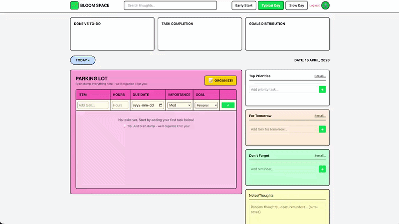
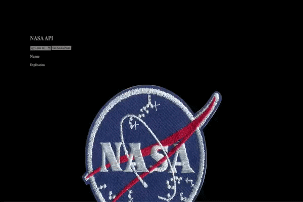
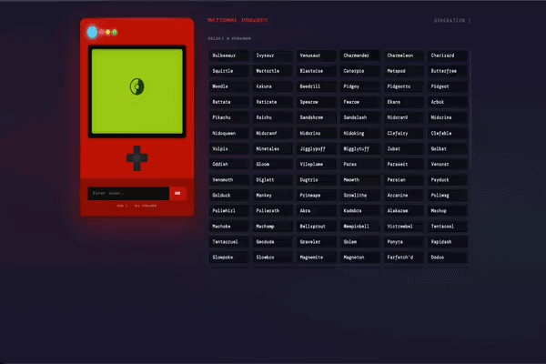
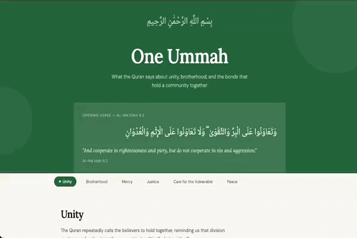
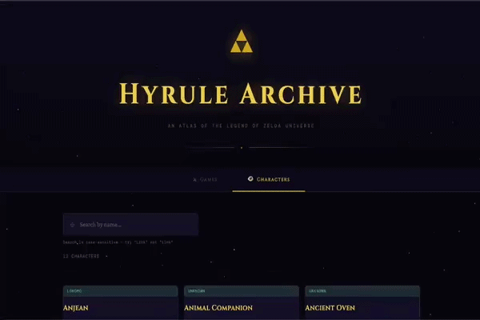
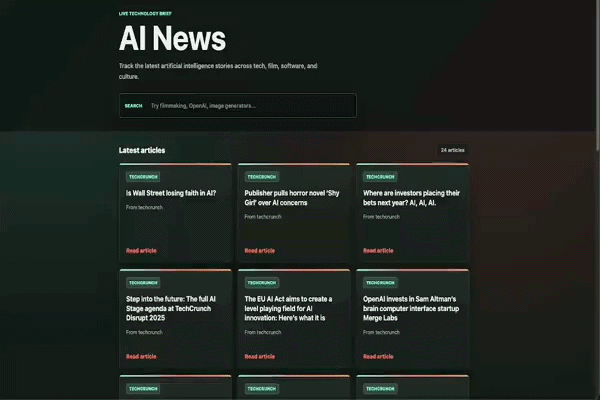
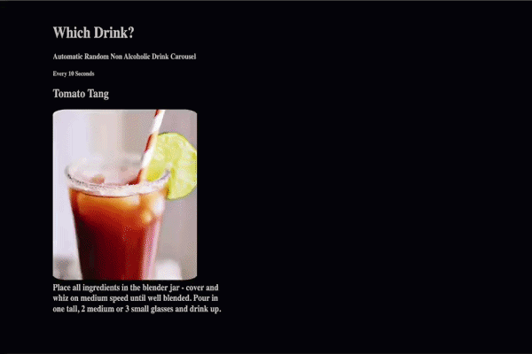
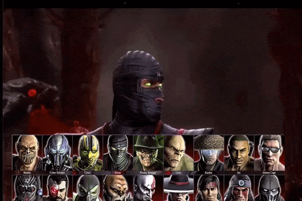
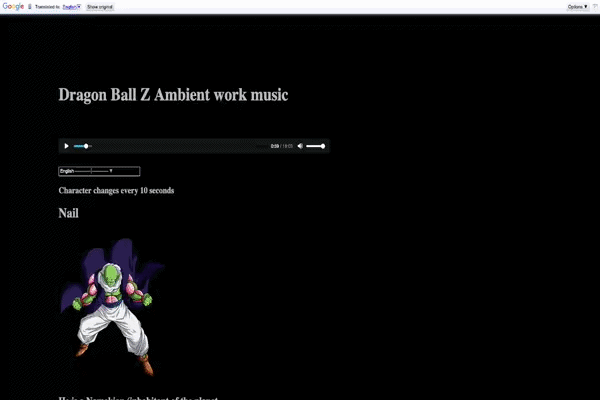
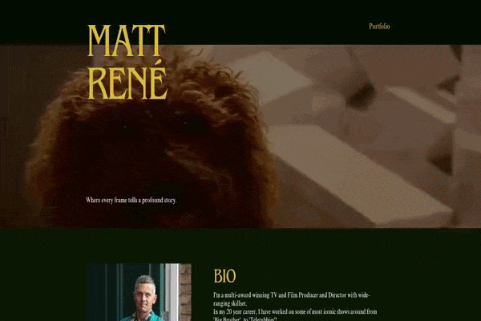

# Hi, I'm Yousef Hosny

Full-stack developer building production-minded web apps, API integrations, and polished client-facing interfaces.

I bring a background in operations, publishing, and stakeholder-facing work into software engineering: clear requirements, practical architecture, reliable delivery, and products people can actually use.

---

## Featured Full-Stack Build

### BloomSpace

A MERN productivity app designed for users with executive function challenges. BloomSpace combines SMART goal planning, energy-aware task filtering, progress visualization, authenticated user flows, and an adaptive dashboard.

`MongoDB` `Express` `React` `Node.js` `TypeScript` `JWT Auth` `Recharts`

<a href="https://github.com/HosnyYousef/bloom-workload-engine">View Repo</a> · <a href="https://bloomspaceproject.netlify.app/" target="_blank" rel="noopener noreferrer">Live Demo</a>

---

## API Integration Projects

<table>
  <tr>
    <td align="center" width="50%">
      <h3>NASA Explorer</h3>
        
      Builds a searchable space-data experience on top of NASA's public APIs, with dynamic rendering for imagery, mission data, and astronomy content.  
      <code>JavaScript</code> <code>REST API</code> <code>HTML</code> <code>CSS</code>  
      <a href="https://github.com/HosnyYousef/NASAapi">View Repo</a> · <a href="https://hosnynasaapi.netlify.app/" target="_blank" rel="noopener noreferrer">Live Demo</a>
    </td>
    <td align="center" width="50%">
      <h3>Pokemon World</h3>
        
      Uses the PokeAPI to fetch and display searchable character data, stats, types, and sprites with responsive UI updates.  
      <code>JavaScript</code> <code>REST API</code> <code>DOM Rendering</code>  
      <a href="https://github.com/HosnyYousef/pokemonAPI">View Repo</a> · <a href="https://pokemonworldapi.netlify.app/" target="_blank" rel="noopener noreferrer">Live Demo</a>
    </td>
  </tr>
  <tr>
    <td align="center" width="50%">
      <h3>Quran Unity</h3>
        
      Presents Quran verses through a clean daily-reading interface, focused on accessible content retrieval and simple navigation.  
      <code>JavaScript</code> <code>REST API</code> <code>HTML</code> <code>CSS</code>  
      <a href="https://github.com/HosnyYousef/QuranAyaADay">View Repo</a> · <a href="https://unityquran.netlify.app/" target="_blank" rel="noopener noreferrer">Live Demo</a>
    </td>
    <td align="center" width="50%">
      <h3>Zelda Tools</h3>
        
      Connects to Zelda game data and turns items, monsters, and series information into a browsable interactive reference tool.  
      <code>JavaScript</code> <code>REST API</code> <code>Search UI</code>  
      <a href="https://github.com/HosnyYousef/APIZeldaTools">View Repo</a> · <a href="https://zeldaworldapi.netlify.app/" target="_blank" rel="noopener noreferrer">Live Demo</a>
    </td>
  </tr>
  <tr>
    <td align="center" width="50%">
      <h3>AI News</h3>
        
      Aggregates current AI articles through a news API, with category filtering and card-based article rendering for fast scanning.  
      <code>JavaScript</code> <code>REST API</code> <code>Filtering</code>  
      <a href="https://github.com/HosnyYousef/api-ai-news">View Repo</a> · <a href="https://newsworldapi.netlify.app/" target="_blank" rel="noopener noreferrer">Live Demo</a>
    </td>
    <td align="center" width="50%">
      <h3>Liquid Drink</h3>
        
      Fetches cocktail recipes, ingredients, and preparation steps from an external API and presents them in a simple discovery flow.  
      <code>JavaScript</code> <code>REST API</code> <code>Responsive UI</code>  
      <a href="https://github.com/HosnyYousef/liquidDrinkAPI">View Repo</a> · <a href="https://drinkscarouselapi.netlify.app/" target="_blank" rel="noopener noreferrer">Live Demo</a>
    </td>
  </tr>
</table>

---

## Interface And Media Projects

<table>
  <tr>
    <td align="center" width="50%">
      <h3>Mortal Kombat Character Picker</h3>
        
      Recreates a character-selection experience with clickable fighters, video playback, audio handling, and game-inspired presentation.  
      <code>JavaScript</code> <code>HTML</code> <code>CSS</code> <code>Media UI</code>  
      <a href="https://github.com/HosnyYousef/backgroundPickerOwn">View Repo</a> · <a href="https://mortalkombatcharacters.netlify.app/" target="_blank" rel="noopener noreferrer">Live Demo</a>
    </td>
    <td align="center" width="50%">
      <h3>DBZ Focus Music</h3>
        
      Builds an ambient study app with timed character rotation, background music controls, and Google Translate support for 100+ languages.  
      <code>JavaScript</code> <code>Google Translate</code> <code>Audio UI</code>  
      <a href="https://github.com/HosnyYousef/DBZ">View Repo</a> · <a href="https://dbzfocusmusic.netlify.app/" target="_blank" rel="noopener noreferrer">Live Demo</a>
    </td>
  </tr>
  <tr>
    <td align="center" width="50%">
      <h3>Matt Rene Filmmaker Portfolio</h3>
        
      Client portfolio site for a filmmaker, balancing project showcases, biography content, contact paths, and a clean visual system.  
      <code>HTML</code> <code>CSS</code> <code>JavaScript</code> <code>Client Work</code>  
      <a href="https://github.com/HosnyYousef/mattRenePortfolio">View Repo</a> · <a href="https://mattrene.netlify.app/" target="_blank" rel="noopener noreferrer">Live Demo</a>
    </td>
    <td align="center" width="50%">
      <h3>Portfolio Pattern</h3>
       
      Across these builds, I focus on clear interaction design, API data handling, responsive layouts, and deployable projects with live demos.  
      <code>Frontend Engineering</code> <code>API Integration</code> <code>Product Thinking</code>  
      <a href="https://github.com/HosnyYousef?tab=repositories">More Repositories</a>
    </td>
  </tr>
</table>

---

## Technical Focus

`React` `TypeScript` `Node.js` `Express` `MongoDB` `JWT Auth` `REST APIs` `JavaScript` `HTML` `CSS` `Git` `Netlify` `Recharts`

I am especially interested in roles where engineering overlaps with users, product thinking, and communication: Solutions Engineering, Developer Advocacy, and Software Engineering.

Based in Vancouver, BC.
